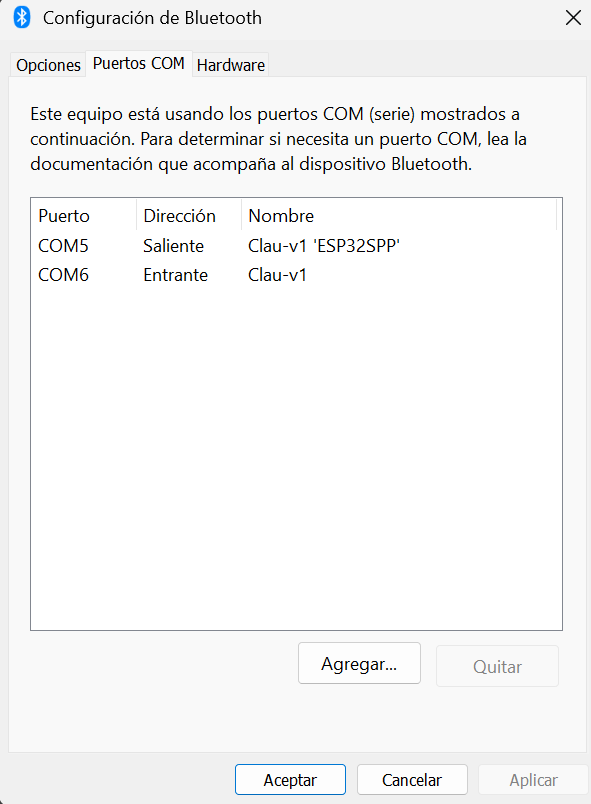

El controlador C.L.A.U. ha sido diseñado para ofrecer un uso sencillo y práctico, y se compone de dos sistemas independientes.

- El primero es el dispositivo C.L.A.U., encargado de registrar y enviar los datos de orientación, aceleración y giro, utilizando un sensor MPU6050 o BNO055.

- El segundo es el dispositivo L.I.Ra., que determina la posición del controlador C.L.A.U. en un plano mediante un sensor infrarrojo.

En esta sección nos concentraremos únicamente en el uso de C.L.A.U.

## Objetos CLAU

Dentro de la librería podemos encontrar el módulo _clau_ que contiene la clase _ClauBNO055_ que hace referencia al controlador C.L.A.U. que usa el sensor BNO055 que ofrece una mayor precisión y simplicidad en el procesamiento de datos.
Con esta clase podemos definir multiples instancias Clau que permiten la comunicación con los diferentes controladores conectados por bluetooth.

```python
from ClauLib.clau import ClauBNO055
```

Esta comunicación se realiza mediante _serial_ por lo que es necesario saber en qué puerto tenemos conectado el controlador deseado.
Para ello en el apartado de _Microcontrolador_ podemos encontrar la forma de definir el nombre de cada dispositivo que será visible cuando se conecte con el sistema objetivo. En nuestro caso, la computadora.

La forma más sencilla de definir un objeto Clau es indicando unicamente el valor de su puerto _COM_.

```python
clau_obj = ClauBNO055(port="COM5")
```

Este puerto es diferente en cada dispositivo y lo podemos encontras llendo a:

_Bluetooth y Dispositivos > Dispositivos > Más opciones de configuración bluetooth_



Aquí en el apartado de puertos podemos encontrar los puertos utilizados y qué dispositivo está en cada uno. En la imagen siguiente se utiliza el puerto saliente.

## Ejemplo de captura de datos

El ejemplo anterior era simplemente para comprobar la conexión y ver cómo podemos manipular la rotación de un cubo. Ahora vamos a usar 2 controladores C.L.A.U. para enviar señales a un programa que registra los datos en un archivo txt. Estos datos corresponden a los datos de orientación de la mano izquierda y la mano derecha.

```python
from ClauLib.clau import ClauBNO055

if __name__ == "__main__":

    # Definición de objetos controlador
    clau_left = ClauBNO055(port="COM5", n_data=10)
    clau_right = ClauBNO055(port="COM5", n_data=10)

    send = ""
    nData = 1000
    file1 = open("myfile.txt","w")

    while send != "1":
        send = input("Ingrese 1 para calibrar los objetos: ")

    print(send)

    #Calibramos los ocontroladores para determinar la orientación 0
    clau_left.calibrate()
    clau_right.calibrate()

    #Captura de datos y procesamiento
    print("Iniciando captura de datos")
    for i in range(nData):
        data_left = clau_left.collect_data()
        data_right = clau_right.collect_data()
        line = (
            str(i) +
            ", right: " + str(data_right) +
            ", left: " + str(data_left) + "\n"
        )
        file1.write(line)

    print("Datos guardados correctamente")
    file1.close()
```

- Read [about how-to guides](https://diataxis.fr/how-to-guides/) in the Diátaxis framework
